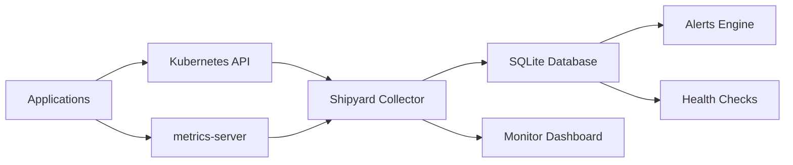

# Monitoring & Observabilité

Guide complet pour surveiller et observer vos applications avec Shipyard.

## Vue d'ensemble

Shipyard fournit un système de monitoring complet qui vous permet de :

- **Surveiller en temps réel** l'état de vos applications
- **Collecter des métriques** détaillées (CPU, mémoire, réseau)
- **Vérifier la santé** via des endpoints HTTP
- **Gérer les alertes** avec des seuils configurables
- **Suivre les événements** du cluster Kubernetes

## Architecture du monitoring



### Composants principaux

1. **Collector** : Collecte les métriques depuis Kubernetes
2. **Base de données** : Stockage SQLite local des métriques
3. **Dashboard** : Interface temps réel avec `shipyard monitor`
4. **Alertes** : Système de seuils et notifications
5. **Health Checks** : Vérifications HTTP périodiques

## Démarrage rapide

### 1. Vérifier les prérequis

```bash
# Vérifier que metrics-server est installé
kubectl get pods -n kube-system | grep metrics-server

# Si absent, installer metrics-server
kubectl apply -f https://github.com/kubernetes-sigs/metrics-server/releases/latest/download/components.yaml
```

### 2. Démarrer le monitoring

```bash
# Lancer le dashboard temps réel
shipyard monitor

# Voir les métriques détaillées
shipyard metrics

# Vérifier la santé des applications
shipyard health
```

### 3. Première analyse

```bash
# Voir les alertes actives
shipyard alerts list

# Suivre les événements en temps réel
shipyard events --follow
```

## Monitoring temps réel

### Dashboard principal

La commande `shipyard monitor` fournit un tableau de bord interactif :

```bash
# Surveiller toutes les applications
shipyard monitor

# Surveiller une application spécifique
shipyard monitor my-app

# Mode compact pour petits terminaux
shipyard monitor --compact

# Rafraîchissement personnalisé
shipyard monitor --interval 10s
```

**Interface du dashboard :**

```
┌─ Shipyard Monitor ─────────────────────────────────────────────────────┐
│ Last updated: 14:32:15 | Press 'q' to quit | Press 'h' for help        │
├────────────────────────────────────────────────────────────────────────┤
│ APP NAME        │ STATUS   │ CPU    │ MEMORY   │ REPLICAS  │ ALERTS │
├─────────────────┼──────────┼────────┼──────────┼───────────┼────────┤
│ web-app         │ 🟢 healthy │ 45.2%  │ 256MB    │ 3/3       │ 0      │
│ api-service     │ 🟡 warning │ 78.9%  │ 512MB    │ 2/3       │ ⚠️ 2   │
└────────────────────────────────────────────────────────────────────────┘
```

### Indicateurs de statut

| Icône | Statut | Description |
|-------|--------|-------------|
| 🟢 | Healthy | Application en bon état |
| 🟡 | Warning | Alertes ou performance dégradée |
| 🔴 | Failed | Application en échec |
| ⚫ | Not Deployed | Application non déployée |

## Analyse des métriques

### Métriques en temps réel

```bash
# Métriques des dernières heures
shipyard metrics --period 1h

# Métriques détaillées pour une app
shipyard metrics my-app --period 6h

# Export pour analyse externe
shipyard metrics --format json --period 1d > metrics.json
```

### Types de métriques collectées

#### Ressources système
- **CPU** : Utilisation en pourcentage
- **Mémoire** : Consommation en MB
- **Réseau** : Trafic entrant/sortant (à venir)
- **Stockage** : Utilisation disque (à venir)

#### Métriques applicatives
- **Pods** : Nombre total et pods prêts
- **Replicas** : Desired vs Running
- **Redémarrages** : Fréquence des redémarrages

#### Performance (si disponible)
- **Requêtes/sec** : Taux de requêtes HTTP
- **Temps de réponse** : Latence moyenne
- **Taux d'erreur** : Pourcentage d'erreurs

### Analyse des tendances

```bash
# Comparer différentes périodes
shipyard metrics --period 1h  # Court terme
shipyard metrics --period 24h # Tendance quotidienne
shipyard metrics --period 7d  # Tendance hebdomadaire
```

## Health Checks

### Configuration des endpoints

Les health checks vérifient la disponibilité via HTTP :

```bash
# État de santé actuel
shipyard health

# Surveillance continue
shipyard health --watch

# Historique des vérifications
shipyard health --history 2h
```

### Endpoints par défaut

- **URL** : `http://service:port/health`
- **Méthode** : GET
- **Timeout** : 5 secondes
- **Intervalle** : 30 secondes

### Configuration personnalisée

```bash
# Voir la configuration actuelle
shipyard alerts config my-app

# La configuration se fait via la base de données
# ou des variables d'environnement (à venir)
```

## Gestion des alertes

### Types d'alertes

#### Alertes de ressources
- **CPU élevé** : > 80% par défaut
- **Mémoire élevée** : > 85% par défaut
- **Stockage plein** : > 90% par défaut

#### Alertes de disponibilité
- **Pod down** : Pod indisponible > 5 minutes
- **Service unavailable** : Health check en échec
- **Redémarrages fréquents** : > 3 en 1 heure

#### Alertes de performance
- **Temps de réponse élevé** : > 1000ms par défaut
- **Taux d'erreur élevé** : > 5% par défaut
- **Faible trafic** : < 10 req/min (anomalie)

### Gestion des alertes

```bash
# Lister les alertes actives
shipyard alerts list

# Historique des alertes
shipyard alerts history --period 1d

# Résoudre une alerte
shipyard alerts resolve 123

# Configuration des seuils
shipyard alerts config my-app
```

### Niveaux de sévérité

| Niveau | Icône | Action recommandée |
|--------|-------|-------------------|
| Info | 🔵 | Information, surveillance |
| Warning | ⚠️ | Investigation requise |
| Critical | 🔴 | Action immédiate |

## Suivi des événements

### Types d'événements

```bash
# Tous les événements récents
shipyard events

# Seulement les erreurs
shipyard events --type error

# Événements en temps réel
shipyard events --follow
```

#### Événements de déploiement
- Scaling des replicas
- Rolling updates
- Rollbacks

#### Événements de pods
- Création/destruction
- Redémarrages
- Échecs de health checks

#### Événements de services
- Modifications de configuration
- Changements d'endpoints
- Problèmes de load balancing

### Diagnostic avec les événements

```bash
# Diagnostiquer un problème récent
shipyard events my-app --type error --since 30m

# Corréler avec les métriques
shipyard metrics my-app --period 30m
shipyard events my-app --since 30m
```

## Bonnes pratiques

### 1. Surveillance proactive

```bash
# Dashboard permanent sur un écran dédié
shipyard monitor --interval 5s

# Surveillance d'alertes critiques
shipyard alerts list --active | grep critical
```

### 2. Endpoints de santé

Implémentez des endpoints riches dans vos applications :

```javascript
// Exemple Node.js/Express
app.get('/health', (req, res) => {
  const health = {
    status: 'healthy',
    timestamp: new Date().toISOString(),
    checks: {
      database: checkDatabase(),
      redis: checkRedis(),
      external_api: checkExternalAPI()
    }
  };
  
  const allHealthy = Object.values(health.checks).every(check => check.status === 'ok');
  res.status(allHealthy ? 200 : 503).json(health);
});
```

### 3. Seuils adaptatifs

Ajustez les seuils selon le contexte :

#### Applications web
- CPU : 70%
- Mémoire : 80%
- Temps de réponse : 500ms

#### APIs
- CPU : 60%
- Mémoire : 75%
- Temps de réponse : 200ms

#### Workers/Jobs
- CPU : 85%
- Mémoire : 90%
- Taux d'échec : 5%

### 4. Rétention des données

- **Métriques détaillées** : 7 jours
- **Métriques agrégées** : 30 jours
- **Alertes** : 90 jours
- **Événements** : 30 jours

## Automatisation

### Scripts de monitoring

```bash
#!/bin/bash
# monitoring-check.sh - Vérification automatique

# Vérifier les alertes critiques
CRITICAL_ALERTS=$(shipyard alerts list --active --format json | jq '[.[] | select(.severity == "critical")] | length')

if [ $CRITICAL_ALERTS -gt 0 ]; then
    echo "🚨 $CRITICAL_ALERTS alertes critiques détectées"
    shipyard alerts list --active | grep critical
    # Envoyer notification (Slack, email, etc.)
fi

# Vérifier la santé globale
UNHEALTHY_APPS=$(shipyard health --format json | jq '[.[] | select(.status != "healthy")] | length')

if [ $UNHEALTHY_APPS -gt 0 ]; then
    echo "🏥 $UNHEALTHY_APPS applications en mauvaise santé"
    shipyard health | grep unhealthy
fi
```

### Intégration CI/CD

```yaml
# .github/workflows/monitoring.yml
name: Post-Deployment Monitoring

on:
  workflow_run:
    workflows: ["Deploy"]
    types: [completed]

jobs:
  monitor:
    runs-on: ubuntu-latest
    steps:
      - name: Wait for deployment stabilization
        run: sleep 60
        
      - name: Check application health
        run: |
          shipyard health ${{ env.APP_NAME }}
          if ! shipyard health ${{ env.APP_NAME }} --format json | jq -e '.[] | select(.status == "healthy")'; then
            echo "❌ Health check failed"
            exit 1
          fi
          
      - name: Verify metrics
        run: |
          # Vérifier que les métriques sont collectées
          shipyard metrics ${{ env.APP_NAME }} --period 5m
          
      - name: Check for alerts
        run: |
          ALERTS=$(shipyard alerts list ${{ env.APP_NAME }} --active --format json | jq 'length')
          if [ $ALERTS -gt 0 ]; then
            echo "⚠️ $ALERTS nouvelles alertes après déploiement"
            shipyard alerts list ${{ env.APP_NAME }} --active
          fi
```

## Dépannage

### Problèmes courants

#### Pas de métriques CPU/mémoire

```bash
# Vérifier metrics-server
kubectl get pods -n kube-system | grep metrics-server

# Vérifier les permissions
kubectl auth can-i get pods.metrics.k8s.io

# Tester manuellement
kubectl top pods
```

#### Health checks en échec

```bash
# Vérifier l'endpoint manuellement
kubectl port-forward svc/my-app 8080:80
curl http://localhost:8080/health

# Vérifier les logs
shipyard logs my-app
```

#### Alertes non déclenchées

```bash
# Vérifier la configuration
shipyard alerts config my-app

# Vérifier les métriques récentes
shipyard metrics my-app --period 30m

# Vérifier les seuils
# Les seuils peuvent être trop élevés
```

### Optimisation des performances

1. **Réduire la fréquence de collecte** pour les environnements avec beaucoup d'applications
2. **Ajuster la rétention** selon l'espace disque disponible
3. **Filtrer les événements** pour réduire le bruit
4. **Utiliser des seuils adaptatifs** selon les heures de pointe

## Roadmap et évolutions

### Phase 2 (à venir)
- Interface web interactive
- Graphiques et visualisations
- Notifications (email, Slack, webhooks)
- Alertes composite et corrélation

### Phase 3 (planifié)
- Métriques custom via Prometheus
- Intégration avec des systèmes externes
- IA pour détection d'anomalies
- Dashboards configurables

## Voir aussi

- [CLI Monitor](../cli/monitor.md) - Référence commande monitor
- [CLI Metrics](../cli/metrics.md) - Référence commande metrics
- [CLI Health](../cli/health.md) - Référence commande health
- [CLI Alerts](../cli/alerts.md) - Référence commande alerts
- [CLI Events](../cli/events.md) - Référence commande events